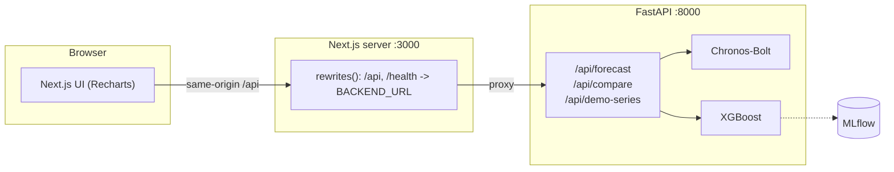

# Daily sales forecasting: Chronos-Bolt vs XGBoost

Daily forecasting app that compares Amazon's Chronos-Bolt (a zero-shot foundation
model) with an XGBoost baseline you train yourself, on ~2 years of real
online-retail sales. FastAPI backend, Next.js frontend, and the deployment
plumbing to go with it: Docker, compose, Kubernetes on kind, and GitHub Actions.


## Architecture



The browser only talks to the Next server, same origin. Next forwards `/api` and
`/health` to FastAPI through `rewrites()`, reading `BACKEND_URL`. The backend
Service is named `backend` in both compose and k8s, so the frontend image is the
same in both places without a rebuild.

## What it does

- Two models behind one API: Chronos-Bolt (no training) and XGBoost (lag +
  calendar features, recursive multi-step).
- Median forecast plus an 80% interval.
- Backtest: hold out recent days and score MAE / RMSE / MAPE / sMAPE, plus a
  rolling-window backtest script for a fairer read than a single holdout.
- Small UI to pick a horizon and model, run a forecast or a backtest, and see the
  chart and metrics.
- Runs on real data out of the box — a daily online-retail sales series is
  bundled; the API also accepts your own series in the request body.

Chronos-Bolt is pretrained on a large corpus of series, so it forecasts a new
series without any fitting — you just hand it the history. XGBoost needs features
and a fit per series. Which one wins depends on the data, which is what the
backtest is for.

## Data & EDA

The bundled series is **UCI Online Retail II** — ~1M invoice lines from a UK
online store (Dec 2009 – Dec 2011), aggregated to **daily sales revenue** by
`backend/data/prepare_dataset.py` (actual sales only; returns and bad prices
dropped). The result is `backend/data/online_retail_daily.csv`, 739 daily points.

Exploratory analysis is in [`notebooks/eda.ipynb`](notebooks/eda.ipynb). The main
findings:

| Finding | Detail |
|---|---|
| Trend | 30-day average roughly doubled, ~£27.5k → ~£56.5k |
| Weekly seasonality | Mon–Thu highest, Sun lower, **Saturday ≈ £0 (store closed)**; ACF peaks at lag 7 (0.58) |
| Distribution | right-skewed (skew 1.8); the big pre-Christmas days are real, not errors |
| STL strength | trend 0.50, seasonal 0.56 |

Cleaning stays light: after aggregation the series is already a gap-free daily
calendar, and closed days are kept as £0 so the weekly pattern stays intact.
Because of those zeros, MAE/RMSE are the reliable scores (MAPE is computed over
non-zero days only). Install `notebooks/requirements.txt` and run the notebook to
regenerate its charts into `docs/`.

## Run it (docker compose)

Needs Docker.

```bash
docker compose up --build
# or: bash scripts/run-local.sh
```

Open http://localhost:3000. Hit "Run forecast" for the next N days, or
"Backtest & compare" to score both models on held-out history. API docs are at
http://localhost:8000/docs.

The first Chronos call downloads `amazon/chronos-bolt-small` and caches it.
XGBoost is instant.

## Backend, tests, training

Run the backend without Docker:

```bash
python -m venv .venv
# Windows: .venv\Scripts\activate   macOS/Linux: source .venv/bin/activate
pip install torch --index-url https://download.pytorch.org/whl/cpu
pip install -r backend/requirements.txt

cd backend
uvicorn app.main:app --reload
pytest -q      # the Chronos test is skipped unless RUN_CHRONOS_TESTS=1
```

Train the XGBoost model (logs to MLflow, saves the fitted model):

```bash
cd backend
python -m training.train_xgboost --horizon 21 --mlflow
mlflow ui      # http://localhost:5000
```

### Backtest results (rolling window)

`python -m training.backtest --horizon 21 --folds 6` holds out several recent
windows instead of just the last one and averages the scores. On the retail
series (lower is better):

| Model | MAE (£) | RMSE (£) | MAPE % | sMAPE % |
|---|---|---|---|---|
| Chronos-Bolt (zero-shot) | 12,400 | 18,909 | **28.3** | 54.4 |
| XGBoost (trained, tuned) | 12,030 | 17,277 | 36.8 | 55.8 |
| **Ensemble (average)** | **11,154** | **16,847** | 30.4 | **53.6** |

The two base models are close, but **averaging them (the ensemble) is the most
accurate** — it beats either alone on MAE, RMSE and sMAPE, because the trained
XGBoost and the zero-shot Chronos make *different* mistakes, so averaging cancels
some error. Absolute errors are large because the windows span the volatile
pre-Christmas surge and the weekly Saturday closures, a deliberately hard test.
Reproduce with the command above, or click **Backtest & compare** in the app.

## Kubernetes (kind)

This runs on GitHub Codespaces without a local Docker or cluster. The
`.devcontainer` sets up Python 3.11, Node 20, Docker-in-Docker, kubectl, helm and
kind.

One shot:

```bash
bash scripts/deploy-kind.sh
```

It creates the cluster, installs ingress-nginx, builds and loads both images,
applies the manifests, and waits for the rollout. What it does, by hand:

```bash
kind create cluster --config k8s/kind-config.yaml
kubectl apply -f https://raw.githubusercontent.com/kubernetes/ingress-nginx/main/deploy/static/provider/kind/deploy.yaml

docker build -t ghcr.io/arhamchoudhary04/ts-forecast-backend:latest  backend
docker build -t ghcr.io/arhamchoudhary04/ts-forecast-frontend:latest frontend
kind load docker-image ghcr.io/arhamchoudhary04/ts-forecast-backend:latest  --name ts-forecast
kind load docker-image ghcr.io/arhamchoudhary04/ts-forecast-frontend:latest --name ts-forecast

# kind-config.yaml is the cluster spec above, not a workload manifest
kubectl apply -f k8s/namespace.yaml
kubectl apply -f k8s/backend-deployment.yaml -f k8s/backend-service.yaml \
              -f k8s/frontend-deployment.yaml -f k8s/frontend-service.yaml \
              -f k8s/ingress.yaml

kubectl get pods -n forecasting
```

Reaching it: either port-forward,

```bash
kubectl -n forecasting port-forward svc/frontend 3000:3000
```

(Codespaces forwards 3000 automatically), or add `127.0.0.1 forecast.local` to
`/etc/hosts` and use the ingress at http://forecast.local.

Images live under `ghcr.io/arhamchoudhary04/`. The deploy script builds and loads
them straight into the kind node (`imagePullPolicy: IfNotPresent`), so local kind
never pulls from a registry. CI pushes the same names to GHCR on merge to `main`.
Forking? Change that namespace in `k8s/*.yaml` and `scripts/deploy-kind.sh`.

## CI

`.github/workflows/ci-cd.yml`, on push/PR to `main`:

- `test`: Python 3.11, CPU torch + backend requirements, `pytest`. The Chronos
  test is skipped so it stays fast and offline.
- `build-and-push` (main only, after tests): logs into GHCR with `GITHUB_TOKEN`
  and pushes both images tagged `:latest` and `:<sha>`, with layer caching.

## Stack

| Layer | Tech |
|---|---|
| Data | UCI Online Retail II, aggregated to daily sales |
| Foundation model | Chronos-Bolt (`amazon/chronos-bolt-small`) |
| Baseline | XGBoost + scikit-learn, lag/calendar features |
| Backend | FastAPI, Pydantic, pandas, NumPy |
| Analysis | Jupyter, statsmodels, seaborn |
| Tracking | MLflow, joblib |
| Frontend | Next.js 14 (App Router, TS), Recharts |
| Packaging | Docker (multi-stage, non-root), compose |
| Orchestration | Kubernetes, kind, ingress-nginx |
| CI/CD | GitHub Actions -> GHCR |

## Screenshots

Run the app and drop screenshots in `docs/` (forecast view, backtest view). The
EDA notebook also writes its charts there when you run it.

## API

| Method | Path | Notes |
|---|---|---|
| GET | `/health` | `{ "status": "ok" }` |
| GET | `/api/demo-series?n_days=730` | recent daily sales history |
| POST | `/api/forecast` | `{ horizon, model: "chronos"\|"xgboost"\|"both", series? }` |
| POST | `/api/compare` | backtest both models: `{ horizon, series? }` |

Leave out `series` and it uses the bundled retail series.

## Layout

```
backend/            FastAPI app, forecasters, training, tests
  app/              data.py, forecaster.py, schemas.py, main.py
  data/             online_retail_daily.csv + prepare_dataset.py
  training/         train_xgboost.py, backtest.py
frontend/           Next.js app
notebooks/          eda.ipynb + requirements.txt
k8s/                namespace, deployments, services, ingress, kind-config
.devcontainer/      Codespaces setup
.github/workflows/  ci-cd.yml
scripts/            run-local.sh, deploy-kind.sh
docker-compose.yml
```
