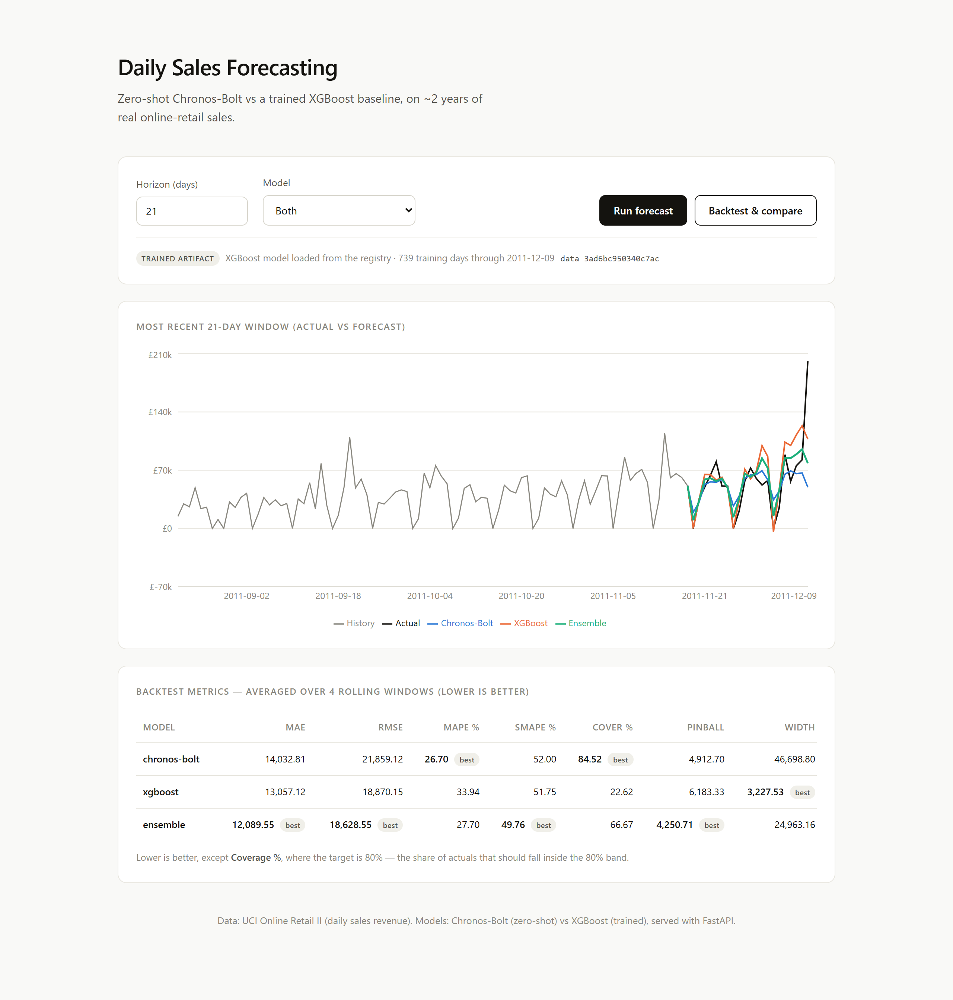
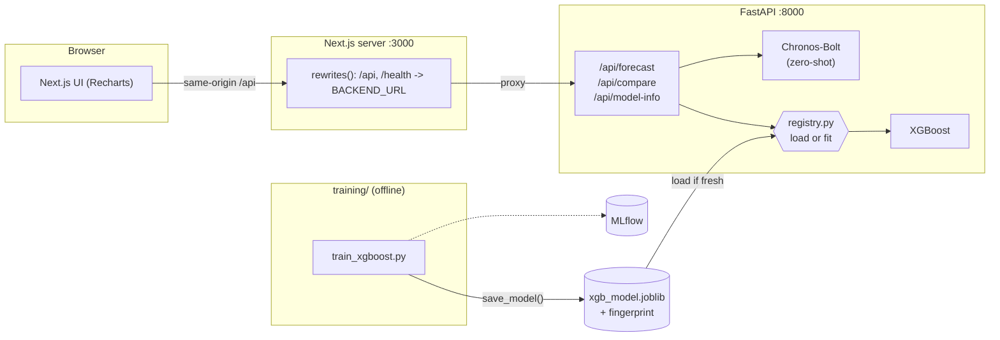
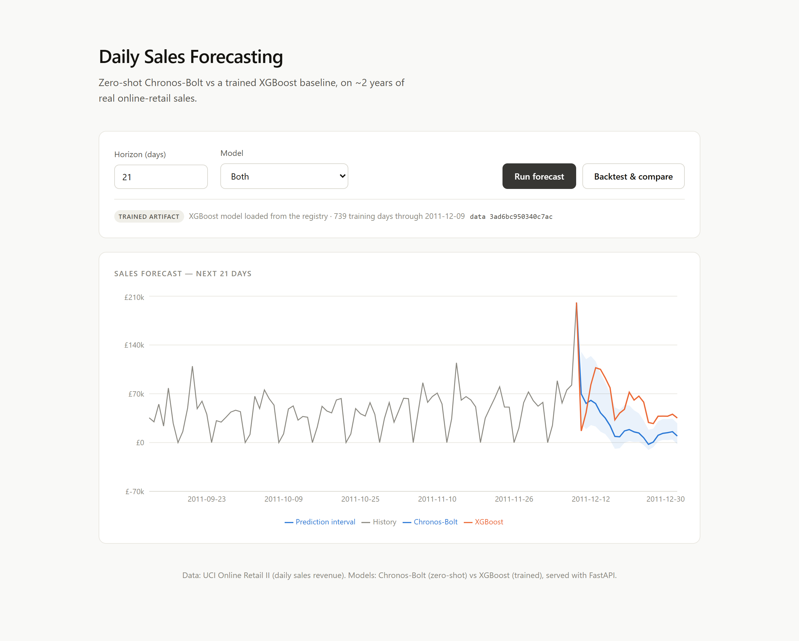

# Daily sales forecasting: Chronos-Bolt vs XGBoost

Daily forecasting app that compares Amazon's Chronos-Bolt (a zero-shot foundation
model) with an XGBoost baseline you train yourself, on ~2 years of real
online-retail sales. FastAPI backend, Next.js frontend, and the deployment
plumbing to go with it: Docker, compose, Kubernetes on kind, and GitHub Actions.



*Backtest view: the most recent 21-day window with both models and their ensemble
against the actuals, scored on point error **and** interval quality. The label under
the controls reports which trained artifact is serving the request.*

## Architecture



Training writes a fingerprinted artifact; the API loads it, and refuses it if the
data it was trained on no longer matches the series being served.

The browser only talks to the Next server, same origin. Next forwards `/api` and
`/health` to FastAPI through `rewrites()`, reading `BACKEND_URL`. The backend
Service is named `backend` in both compose and k8s, so the frontend image is the
same in both places without a rebuild.

## What it does

- Two models behind one API: Chronos-Bolt (no training) and XGBoost (lag +
  calendar features, recursive multi-step), plus their ensemble.
- Median forecast plus an 80% interval, and the interval is scored rather than just
  drawn: coverage, pinball loss and band width alongside MAE / RMSE / MAPE / sMAPE.
- Rolling-window backtest rather than a single holdout, since this series ends on
  a volatile pre-Christmas peak that one window would misrepresent.
- A model registry linking training to serving, with staleness detection: the
  API loads the trained artifact instead of refitting per request.
- Small UI to pick a horizon and model, run a forecast or a backtest, and see the
  chart, metrics and which model version is answering.
- Runs on real data out of the box: a daily online-retail sales series is
  bundled, and the API also accepts your own series in the request body.

Chronos-Bolt is pretrained on a large corpus of series, so it forecasts a new
series without any fitting; you just hand it the history. XGBoost needs features
and a fit per series. Which one wins depends on the data, which is what the
backtest is for.

## Data & EDA

The bundled series is **UCI Online Retail II**: ~1M invoice lines from a UK
online store (Dec 2009 – Dec 2011), aggregated to **daily sales revenue** by
`backend/data/prepare_dataset.py` (actual sales only; returns and bad prices
dropped). The result is `backend/data/online_retail_daily.csv`, 739 daily points.

Exploratory analysis is in [`notebooks/eda.ipynb`](notebooks/eda.ipynb). The main
findings:

| Finding | Detail |
|---|---|
| Trend | 30-day average roughly doubled, ~£27.5k → ~£56.5k |
| Weekly seasonality | Mon–Thu highest, Sun lower, **Saturday ≈ £0 (store closed)**; ACF peaks at lag 7 (0.58) |
| Distribution | right-skewed (skew 1.8); the big pre-Christmas days are real, not errors |
| STL strength | trend 0.50, seasonal 0.56 |

Cleaning stays light: after aggregation the series is already a gap-free daily
calendar, and closed days are kept as £0 so the weekly pattern stays intact.
Because of those zeros, MAE/RMSE are the reliable scores (MAPE is computed over
non-zero days only). Install `notebooks/requirements.txt` and run the notebook to
regenerate its charts into `docs/`.

## Run it (docker compose)

Needs Docker.

```bash
docker compose up --build
# or: bash scripts/run-local.sh
```

Open http://localhost:3000. Hit "Run forecast" for the next N days, or
"Backtest & compare" to score both models on held-out history. API docs are at
http://localhost:8000/docs.

The first Chronos call downloads `amazon/chronos-bolt-small` and caches it.
XGBoost is instant.

## Backend, tests, training

Run the backend without Docker:

Dependencies are split by role, so the serving image doesn't ship MLflow or the
test tooling:

| File | Contents |
|---|---|
| `backend/requirements.txt` | serving only, what the API image installs |
| `backend/requirements-dev.txt` | serving + pytest/httpx |
| `backend/requirements-train.txt` | serving + MLflow |

```bash
python -m venv .venv
# Windows: .venv\Scripts\activate   macOS/Linux: source .venv/bin/activate
pip install torch --index-url https://download.pytorch.org/whl/cpu
pip install -r backend/requirements-dev.txt

cd backend
uvicorn app.main:app --reload
pytest -q      # the Chronos test is skipped unless RUN_CHRONOS_TESTS=1
```

`pytest` covers the API surface plus the modelling logic that the numbers below
depend on: that features never look forward (`tests/test_features.py`), that
every metric matches hand-computed arithmetic (`tests/test_metrics.py`), that
backtest windows never overlap their training prefix (`tests/test_backtest.py`),
and that the registry refuses a model trained on different data
(`tests/test_registry.py`).

### Training → serving

The training script writes a **versioned artifact** through `app/registry.py`,
and the API loads it, so the model you evaluate is the model that serves:

```bash
cd backend
pip install -r requirements-train.txt
python -m training.train_xgboost --horizon 21 --mlflow
mlflow ui      # http://localhost:5000
```

```bash
curl localhost:8000/api/model-info
```

```jsonc
{
  "source": "artifact",            // or "fit-on-demand" if none was usable
  "trained_at": "2026-07-29T…",
  "n_train_points": 739,
  "train_end": "2011-12-09",
  "data_fingerprint": "a1b2c3d4e5f60718"
}
```

The registry resolves a model in this order:

1. Load the artifact at `MODEL_PATH` (baked into the backend image at build
   time, so a fresh container always has a trained model).
2. If it is missing, unreadable, or **stale**, fit once on the bundled series and
   cache that for the process lifetime.

"Stale" is checked by fingerprinting the training series and comparing it to the
CSV on disk. Serving a model trained on data that no longer matches what you are
forecasting from is a silent failure mode, so the registry refuses it rather than
returning quietly wrong numbers. The UI shows which path was taken.

Caller-supplied series in the request body are always fit per request, since the
cached model belongs to the bundled series.

### Backtest results (rolling window)

`python -m training.backtest --horizon 21 --folds 6` holds out several recent
windows instead of just the last one and averages the scores. Both scripts and
the `/api/compare` endpoint share the same `backtest_windows()` helper, so they
cut windows identically. On the retail series:

Point-forecast error (lower is better):

| Model | MAE (£) | RMSE (£) | MAPE % | sMAPE % |
|---|---|---|---|---|
| Chronos-Bolt (zero-shot) | 12,400 | 18,909 | **28.3** | 54.4 |
| XGBoost (trained, tuned) | 12,030 | 17,277 | 36.8 | 55.8 |
| **Ensemble (average)** | **11,154** | **16,847** | 30.4 | **53.6** |

The two base models are close, but **averaging them (the ensemble) is the most
accurate**: it beats either alone on MAE, RMSE and sMAPE, because the trained
XGBoost and the zero-shot Chronos make *different* mistakes, so averaging cancels
some error. Absolute errors are large because the windows span the volatile
pre-Christmas surge and the weekly Saturday closures, a deliberately hard test.

### Interval quality

Both models emit an 80% band, so the backtest scores the band too. Coverage is
the share of actuals inside it, where closest to 80 wins rather than highest.
Pinball loss is mean quantile loss, a proper scoring rule, so unlike coverage it
can't be improved by just widening the band.

| Model | Coverage % (target 80) | Pinball | Mean width (£) |
|---|---|---|---|
| Chronos-Bolt (zero-shot) | **81.0** | 4,314 | 40,039 |
| XGBoost (trained, tuned) | 22.2 | 5,674 | **3,182** |
| **Ensemble (average)** | 61.9 | **4,011** | 21,610 |

XGBoost wins on MAE but covers only 22% of actuals. Its band is a constant
±1.2816σ of the in-sample residual, roughly £3.2k, which is far too tight for a
series that swings from £0 Saturdays to six-figure December days. Chronos
predicts per-step quantiles and lands at 81.0% against an 80% target. The
ensemble takes the best pinball loss, so it wins on the proper scoring rule as
well as on MAE/RMSE/sMAPE.

Use XGBoost for a point estimate and Chronos where the uncertainty range matters.
Fixing XGBoost's interval (quantile regression, or conformal calibration on a
holdout) is the obvious next step.

The command above reproduces every number here. The app's **Backtest & compare**
button defaults to 4 folds rather than 6 to keep the request quick, so its numbers
differ slightly; pass `folds` in the request body to match.

## Kubernetes (kind)

This runs on GitHub Codespaces without a local Docker or cluster. The
`.devcontainer` sets up Python 3.11, Node 20, Docker-in-Docker, kubectl, helm and
kind.

One shot:

```bash
bash scripts/deploy-kind.sh
```

It creates the cluster, installs ingress-nginx, builds and loads both images,
applies the manifests, and waits for the rollout. What it does, by hand:

```bash
kind create cluster --config k8s/kind-config.yaml
kubectl apply -f https://raw.githubusercontent.com/kubernetes/ingress-nginx/main/deploy/static/provider/kind/deploy.yaml

docker build -t ghcr.io/arhamchoudhary04/ts-forecast-backend:latest  backend
docker build -t ghcr.io/arhamchoudhary04/ts-forecast-frontend:latest frontend
kind load docker-image ghcr.io/arhamchoudhary04/ts-forecast-backend:latest  --name ts-forecast
kind load docker-image ghcr.io/arhamchoudhary04/ts-forecast-frontend:latest --name ts-forecast

# kind-config.yaml is the cluster spec above, not a workload manifest
kubectl apply -f k8s/namespace.yaml
kubectl apply -f k8s/backend-deployment.yaml -f k8s/backend-service.yaml \
              -f k8s/frontend-deployment.yaml -f k8s/frontend-service.yaml \
              -f k8s/ingress.yaml

kubectl get pods -n forecasting
```

Reaching it: either port-forward,

```bash
kubectl -n forecasting port-forward svc/frontend 3000:3000
```

(Codespaces forwards 3000 automatically), or add `127.0.0.1 forecast.local` to
`/etc/hosts` and use the ingress at http://forecast.local.

Images live under `ghcr.io/arhamchoudhary04/`. The deploy script builds and loads
them straight into the kind node (`imagePullPolicy: IfNotPresent`), so local kind
never pulls from a registry. CI pushes the same names to GHCR on merge to `main`.
Forking? Change that namespace in `k8s/*.yaml` and `scripts/deploy-kind.sh`.

## CI

`.github/workflows/ci-cd.yml`, on push/PR to `main`:

| Job | What it does |
|---|---|
| `backend` | Python 3.11, CPU torch, `pytest`. Chronos is skipped so it stays fast and offline. Uploads `pip freeze` output as the record of exactly which versions the run resolved. |
| `frontend` | `npm ci`, then lint, `tsc --noEmit`, and `next build`, so a type or build error fails the **PR**, not `main`. |
| `audit` | `npm audit` on runtime deps (fails on critical) plus `pip-audit`. Currently **0 advisories**, runtime and dev; `package.json` `overrides` pull patched `postcss` / `sharp` / `brace-expansion` through Next's transitive tree. |
| `docker` | PRs only: builds both images without pushing, which also exercises the model-training build step. |
| `build-and-push` | main only, after tests: logs into GHCR with `GITHUB_TOKEN` and pushes both images tagged `:latest` and `:<sha>`, with layer caching. |

## Stack

| Layer | Tech |
|---|---|
| Data | UCI Online Retail II, aggregated to daily sales |
| Foundation model | Chronos-Bolt (`amazon/chronos-bolt-small`) |
| Baseline | XGBoost + scikit-learn, lag/calendar features |
| Backend | FastAPI, Pydantic, pandas, NumPy |
| Analysis | Jupyter, statsmodels, seaborn |
| Tracking | MLflow (training only), joblib artifact registry with fingerprinting |
| Tests | pytest: leakage, metric arithmetic, window boundaries, registry staleness |
| Frontend | Next.js 15 (App Router, TS), React 19, Recharts |
| Packaging | Docker (multi-stage, non-root), compose |
| Orchestration | Kubernetes, kind, ingress-nginx |
| CI/CD | GitHub Actions -> GHCR |

## Screenshots

**Forecast view.** Pick a horizon and model, then forecast forward past the end of
the history. Chronos-Bolt's shaded band is its predicted 80% interval.



**Backtest view.** Hold out recent windows and score both models plus the ensemble
against the truth ([tables above](#backtest-results-rolling-window)).


Both captured from the production build (`npm run build && npm start`) at 2× DPI.
The EDA notebook writes its charts into `docs/` too when you run it.

## API

| Method | Path | Notes |
|---|---|---|
| GET | `/health` | `{ "status": "ok" }` |
| GET | `/api/model-info` | provenance of the serving model: artifact vs fit-on-demand, training range, data fingerprint |
| GET | `/api/demo-series?n_days=730` | recent daily sales history |
| POST | `/api/forecast` | `{ horizon, model: "chronos"\|"xgboost"\|"both"\|"ensemble", series? }` |
| POST | `/api/compare` | rolling backtest: `{ horizon, folds?, series? }`, point **and** interval metrics |

Leave out `series` and it uses the bundled retail series. Backtests of the
bundled series are memoised per `(horizon, folds)`, since it is the expensive
endpoint: every fold refits XGBoost and reruns Chronos.

## Layout

```
backend/            FastAPI app, forecasters, training, tests
  app/              data.py, forecaster.py, registry.py, schemas.py, main.py
  data/             online_retail_daily.csv + prepare_dataset.py
  training/         train_xgboost.py, backtest.py
  tests/            api, features (leakage), metrics, backtest windows, registry
  requirements*.txt serving / -dev / -train
frontend/           Next.js app
notebooks/          eda.ipynb + requirements.txt
k8s/                namespace, deployments, services, ingress, kind-config
.devcontainer/      Codespaces setup
.github/workflows/  ci-cd.yml
scripts/            run-local.sh, deploy-kind.sh
docker-compose.yml
```
