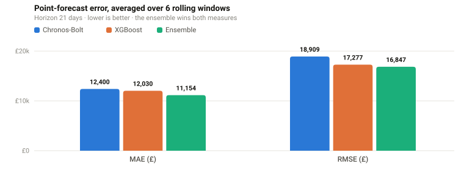
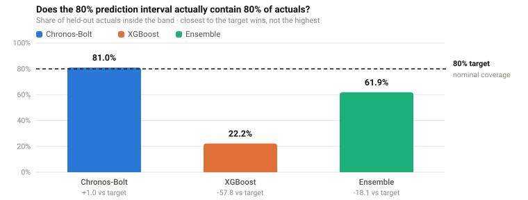
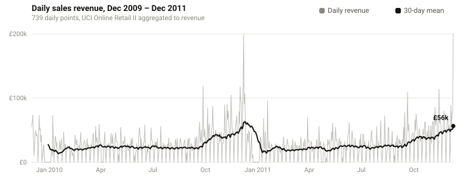
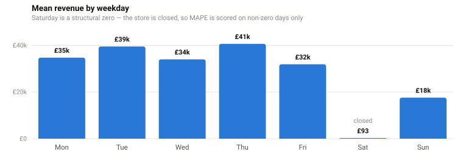
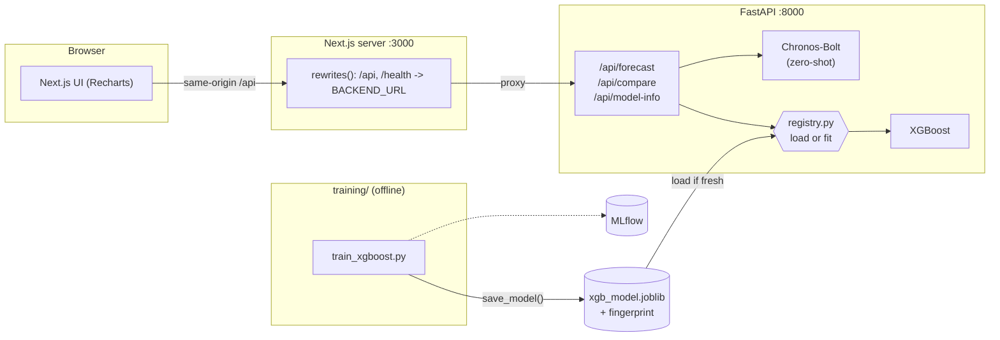

<div align="center">

# Daily Sales Forecasting

### A zero-shot foundation model vs a trained baseline, scored on point accuracy **and** uncertainty

Amazon's **Chronos-Bolt** forecasts a series it has never seen. **XGBoost** is trained on that
series with lag and calendar features. Both are served from one FastAPI app, plotted in a Next.js
UI, and judged by a rolling-origin backtest that scores the *prediction interval*, not just the line
through the middle.

[](#tech-stack)
[](#api)
[](#tech-stack)
[](#tech-stack)
[](#the-app)
[](#the-app)
[](#run-it)
[](#run-it)
[](#quality-gates)

**[Results](#results) · [Data](#the-data) · [Architecture](#architecture) · [Engineering decisions](#engineering-decisions) · [Tech stack](#tech-stack) · [Quality gates](#quality-gates) · [API](#api) · [Run it](#run-it)**

</div>


<div align="center"><sub><b>Backtest view.</b> The most recent 21-day window, both models plus their ensemble against the actuals, scored on point error <b>and</b> interval quality. The line under the controls reports which trained artifact is answering the request.</sub></div>

---

> [!IMPORTANT]
> **The result that matters.** XGBoost wins on MAE, and its 80% prediction interval contains only
> **22.2%** of actual values. Chronos-Bolt lands at **81.0%** against an 80% target. Judge these two
> models on point error alone and you ship the one that is confidently wrong about its own
> uncertainty. That failure is invisible to MAE, RMSE, MAPE and sMAPE; it takes coverage and pinball
> loss to see it, which is why this project scores the band.

## Results

Rolling-origin backtest, horizon 21 days, averaged over 6 non-overlapping windows. Reproduce every
number below with `cd backend && python -m training.backtest --horizon 21 --folds 6`.

### Point accuracy

<picture>
  <source media="(prefers-color-scheme: dark)" srcset="docs/fig-point-error-dark.svg">
  
</picture>

| Model | MAE (£) | RMSE (£) | MAPE % | sMAPE % |
|:---|---:|---:|---:|---:|
| Chronos-Bolt (zero-shot) | 12,400 | 18,909 | **28.3** | 54.4 |
| XGBoost (trained, tuned) | 12,030 | 17,277 | 36.8 | 55.8 |
| **Ensemble (mean of both)** | **11,154** | **16,847** | 30.4 | **53.6** |

The two base models finish close, and **averaging them beats either one** on MAE, RMSE and sMAPE.
That is not luck: a trained gradient-boosting model and a pretrained transformer make *different*
mistakes, so the errors partly cancel. Absolute errors are large on purpose: the windows span the
pre-Christmas surge and the weekly closures, which is a deliberately hard test rather than a
flattering one.

### Interval quality

<picture>
  <source media="(prefers-color-scheme: dark)" srcset="docs/fig-coverage-dark.svg">
  
</picture>

| Model | Coverage % (target 80) | Pinball | Mean width (£) |
|:---|---:|---:|---:|
| Chronos-Bolt (zero-shot) | **81.0** | 4,314 | 40,039 |
| XGBoost (trained, tuned) | 22.2 | 5,674 | **3,182** |
| **Ensemble (mean of both)** | 61.9 | **4,011** | 21,610 |

Coverage is the share of actuals that land inside the band, and **closest to 80 wins, not the
highest**, because a band of ±∞ would score 100%. Pinball loss is mean quantile loss, a proper
scoring rule, so unlike coverage it cannot be improved by simply widening the interval.

XGBoost's band is a constant ±1.2816σ of its in-sample residual, about £3.2k. That is far too tight
for a series that swings from £0 closed Saturdays to six-figure December days, hence 22.2%. Chronos
predicts a genuine quantile per step and calibrates almost perfectly. The ensemble takes the best
pinball loss, so it wins the proper scoring rule as well as MAE, RMSE and sMAPE.

> [!TIP]
> **Practical read.** Use XGBoost when you need a cheap point estimate, Chronos-Bolt when the
> uncertainty range is the decision input, and the ensemble when you want both. Fixing XGBoost's
> interval (quantile regression objectives, or conformal calibration on a holdout) is the clear
> next step, and the harness to measure it already exists.

<sub>The app's **Backtest & compare** button defaults to 4 folds instead of 6 to keep the request
snappy, so its numbers differ slightly; pass `folds` in the request body to match the table.</sub>

## The data

**UCI Online Retail II**: roughly 1M invoice lines from a UK online store, Dec 2009 to Dec 2011,
aggregated to **daily sales revenue** by `backend/data/prepare_dataset.py` (real sales only; returns
and bad prices dropped). The result is 739 gap-free daily points.

<picture>
  <source media="(prefers-color-scheme: dark)" srcset="docs/fig-series-dark.svg">
  
</picture>

<picture>
  <source media="(prefers-color-scheme: dark)" srcset="docs/fig-weekday-dark.svg">
  
</picture>

Full exploratory analysis is in [`notebooks/eda.ipynb`](notebooks/eda.ipynb):

| Finding | Detail | Why it changes the modelling |
|:---|:---|:---|
| Trend | 30-day mean roughly doubled, £27.5k → £56.5k | recursive multi-step forecasting must not flatten out |
| Weekly seasonality | Mon–Thu highest, Sun lower, **Sat ≈ £0 (closed)**; ACF peaks at lag 7 (0.58) | `lag_7` and `dayofweek` are the load-bearing features |
| Distribution | right-skewed (skew 1.8) | the huge December days are real, not outliers to clip |
| STL strength | trend 0.50, seasonal 0.56 | both components matter, so neither can be differenced away |

Cleaning stays deliberately light: after aggregation the series is already a complete daily calendar,
and closed days are kept as **£0 rather than dropped**, so the weekly pattern stays intact. Those
structural zeros are exactly why MAE and RMSE are the trustworthy headline scores here and MAPE is
computed over non-zero days only; see [Engineering decisions](#engineering-decisions).

<sub>Figures are generated by [`docs/make_figures.py`](docs/make_figures.py): hand-rolled SVG, no
plotting dependency, light and dark variants so they read correctly in either GitHub theme. The
series and weekday charts are computed from the bundled CSV, so they cannot drift from the data.</sub>

## Architecture



The browser only ever talks to the Next server, same origin, so there is no CORS in the happy path. Next
forwards `/api` and `/health` to FastAPI through `rewrites()`, reading `BACKEND_URL` at build and
start. The backend Service is named `backend` in both compose and Kubernetes, so **the same frontend
image runs in both places without a rebuild**. Training writes a fingerprinted artifact that the API
loads and will refuse if it no longer matches the data being served.

## Engineering decisions

The part a reviewer usually has to dig for. Each of these is a deliberate choice with a cost.

<table>
<tr><td width="50%" valign="top">

**1. Score the interval, not just the line.**
Coverage alone is gameable (widen the band and it goes to 100%), so the backtest also reports
pinball loss, a proper scoring rule, and mean band width as the price paid for that coverage. This
is what exposed XGBoost's 22.2% calibration failure.

</td><td width="50%" valign="top">

```python
inside = (actual >= lower) & (actual <= upper)
losses = [
    pinball_loss(actual, q, level)
    for q, level in zip((lower, median, upper),
                        QUANTILE_LEVELS)
]
```

</td></tr>
<tr><td valign="top">

**2. Rolling-origin evaluation, one shared window function.**
This series *ends* on the volatile pre-Christmas peak, so a single last-window holdout would be a
coin flip dressed up as a benchmark. The CLI script and the `/api/compare` endpoint call the same
`backtest_windows()`, so the app and the tables can never disagree about how windows were cut.

</td><td valign="top">

```python
for i in range(folds):
    end = n_points - i * step
    start = end - horizon
    if start < min_train:
        break
    windows.append((start, end))
```

</td></tr>
<tr><td valign="top">

**3. Features that cannot see the future.**
Every rolling window is `.shift(1)`-ed *before* aggregating, so a row's own target never reaches its
own features. Lookahead leakage is the classic way a time-series model posts great offline numbers
and dies in production, so it is pinned by a test rather than by a comment.

</td><td valign="top">

```python
out[f"lag_{lag}"] = out["value"].shift(lag)
out["roll_mean_7"] = (
    out["value"].shift(1).rolling(7).mean()
)
```

</td></tr>
<tr><td valign="top">

**4. Train/serve parity, enforced by a fingerprint.**
Training persists a versioned artifact; the API loads it instead of refitting per request. The
payload carries a content hash of its training series, and the registry **refuses** a model whose
fingerprint no longer matches the CSV on disk. Serving a stale model is a silent failure, so it is
turned into a loud one and surfaced in the UI.

</td><td valign="top">

```python
if payload.get("data_fingerprint") != expected_fingerprint:
    raise ValueError(
        "artifact was trained on different data "
        "than the bundled series ..."
    )
```

</td></tr>
<tr><td valign="top">

**5. Metrics chosen for this data's shape.**
Saturday revenue is a structural £0, and MAPE divides by the actual. Rather than quietly producing
infinities, MAPE is averaged over non-zero points only while MAE, RMSE and sMAPE use every point;
the README says so wherever a MAPE number appears.

</td><td valign="top">

```python
nz = np.abs(actual) > 1e-8
mape = float(
    np.mean(np.abs(err[nz] / actual[nz])) * 100
) if nz.any() else 0.0
```

</td></tr>
<tr><td valign="top">

**6. Determinism and cost control.**
`random_state=42`, one process-wide cached model behind a lock, and backtests of the bundled series
memoised on `(horizon, folds, fingerprint)`: the fingerprint is in the key so a regenerated CSV
invalidates the cache instead of serving stale scores. Backtesting is the expensive endpoint: every
fold refits XGBoost and reruns Chronos.

</td><td valign="top">

```python
@lru_cache(maxsize=16)
def _compare_bundled(horizon: int, folds: int,
                     _fingerprint: str) -> dict:
    return compare_models(load_retail_series(),
                          horizon, folds=folds)
```

</td></tr>
</table>

**7. Dependencies split by role**, so the serving image ships neither MLflow's Flask/SQLAlchemy tree
nor the test tooling:

| File | Contents |
|:---|:---|
| `backend/requirements.txt` | serving only: what the API image installs |
| `backend/requirements-dev.txt` | serving + pytest/httpx |
| `backend/requirements-train.txt` | serving + MLflow |

**8. The UI tells the truth about the model.** The frontend judges coverage against the nominal
target rather than picking the maximum, renders a dash instead of crashing on a non-finite metric,
draws only the series actually present in the response, and shows whether the answer came from a
trained artifact or an on-demand fit.

## Tech stack

| Layer | Choice | Why this one |
|:---|:---|:---|
| **Foundation model** | Chronos-Bolt (`amazon/chronos-bolt-small`), CPU torch | pretrained on a large corpus of series, so it forecasts with **zero fitting** and emits real per-step quantiles |
| **Baseline** | XGBoost 3.3 + scikit-learn | strong tabular learner on 6 lags, 3 rolling stats and 4 calendar features, recursive multi-step |
| **Ensemble** | mean of both quantile sets | uncorrelated errors cancel; best MAE, RMSE, sMAPE and pinball loss |
| **Evaluation** | rolling-origin backtest, pinball loss, coverage, band width | proper scoring rules, not just point error |
| **API** | FastAPI + Pydantic v2, `lru_cache` memoisation | typed request/response schemas, validation at the edge, auto OpenAPI docs |
| **Model registry** | joblib artifact + SHA-256 data fingerprint, versioned payload | links training to serving and refuses stale models |
| **Experiment tracking** | MLflow (training only) | params, metrics and artifacts per run, kept out of the serving image |
| **Data** | UCI Online Retail II → daily revenue, pandas + NumPy | real, messy, seasonal data instead of a synthetic sine wave |
| **Analysis** | Jupyter, statsmodels (STL, ACF), seaborn | seasonality and trend strength quantified, not eyeballed |
| **Tests** | pytest, 76 passing, 2 Chronos tests opt-in | leakage, metric arithmetic, window boundaries, registry staleness, API contract |
| **Frontend** | Next.js 15 App Router, React 19, TypeScript, Recharts | server-side rewrites keep the browser same-origin; charts are theme-consistent with the figures above |
| **Packaging** | Docker multi-stage, non-root, `npm ci` | model trained at image build, so a fresh container is never cold |
| **Orchestration** | Kubernetes manifests, kind, ingress-nginx | one deploy script from empty cluster to working ingress |
| **CI/CD** | GitHub Actions → GHCR, `pip-audit` + `npm audit` | five jobs gating tests, types, build, advisories and images |

<details>
<summary><b>What this project demonstrates, mapped to the work</b></summary>

<br>

| Skill | Where to look |
|:---|:---|
| Time-series feature engineering without leakage | `app/data.py`, pinned by `tests/test_features.py` |
| Foundation-model inference and quantile handling | `app/forecaster.py`: `chronos_forecast`, `ensemble_forecast` |
| Honest evaluation design | `backtest_windows`, `evaluate_interval`, `training/backtest.py` |
| Diagnosing a calibration failure, not just reporting a metric | the 22.2% coverage finding and its root cause |
| MLOps: artifact versioning, staleness detection, provenance endpoint | `app/registry.py`, `GET /api/model-info` |
| Production API design | `app/main.py`, `app/schemas.py`: validation, caching, error codes |
| Full-stack delivery | Next.js 15 UI wired to the API through server rewrites |
| Containerisation and orchestration | `backend/Dockerfile`, `frontend/Dockerfile`, `k8s/`, `scripts/deploy-kind.sh` |
| CI/CD and supply-chain hygiene | `.github/workflows/ci-cd.yml`, dependency `overrides`, audit job |

</details>

## Quality gates

**76 tests pass, 2 skip** (the Chronos tests download a model, so they are opt-in via
`RUN_CHRONOS_TESTS=1`). The suite targets the claims this README makes:

| Test file | What it pins down |
|:---|:---|
| `tests/test_features.py` | no feature can see its own row's target (lookahead leakage) |
| `tests/test_metrics.py` | every metric matches hand-computed arithmetic |
| `tests/test_backtest.py` | windows never overlap their own training prefix |
| `tests/test_registry.py` | a model trained on different data is refused |
| `tests/test_api.py` | status codes, validation, ordered bands, determinism, JSON-safe params |

`.github/workflows/ci-cd.yml`, on every push and PR to `main`:

| Job | What it does |
|:---|:---|
| `backend` | Python 3.11, CPU torch, `pytest`. Uploads `pip freeze` as the record of exactly which versions the run resolved. |
| `frontend` | `npm ci`, ESLint, `tsc --noEmit`, `next build`, so a type or build error fails the **PR**, not `main`. |
| `audit` | `npm audit` on runtime deps (fails on critical) plus `pip-audit`. `package.json` `overrides` pull patched `postcss` / `sharp` / `brace-expansion` through Next's transitive tree. |
| `docker` | PRs only: builds both images without pushing, which also exercises the model-training build step. |
| `build-and-push` | `main` only, after tests: pushes both images to GHCR tagged `:latest` and `:<sha>`, with layer caching. |

## API

Interactive OpenAPI docs at `http://localhost:8000/docs`.

| Method | Path | Notes |
|:---|:---|:---|
| `GET` | `/health` | `{ "status": "ok" }` |
| `GET` | `/api/model-info` | serving provenance: artifact vs fit-on-demand, training range, data fingerprint |
| `GET` | `/api/demo-series?n_days=730` | recent daily sales history for plotting |
| `POST` | `/api/forecast` | `{ horizon, model: "chronos"\|"xgboost"\|"both"\|"ensemble", series? }` |
| `POST` | `/api/compare` | rolling backtest: `{ horizon, folds?, series? }`, point **and** interval metrics |

Omit `series` and the bundled retail series is used; supply your own (≥ 60 points) and it is fitted
per request, since the cached model belongs to the bundled data.

```bash
curl localhost:8000/api/model-info
```

```jsonc
{
  "source": "artifact",            // or "fit-on-demand" if none was usable
  "trained_at": "2026-07-29T…",
  "n_train_points": 739,
  "train_end": "2011-12-09",
  "data_fingerprint": "a1b2c3d4e5f60718"
}
```

The registry resolves a model in this order:

1. Load the artifact at `MODEL_PATH` (baked into the backend image at build time), so a fresh
   container always serves a trained model.
2. If it is missing, unreadable, or **stale by fingerprint**, fit once on the bundled series and
   cache that for the process lifetime.

## Run it

<table>
<tr><td valign="top" width="50%">

**Docker compose**, the whole stack:

```bash
docker compose up --build
# or: bash scripts/run-local.sh
```

Open **http://localhost:3000**. The first Chronos call downloads
`amazon/chronos-bolt-small` and caches it; XGBoost is instant.

</td><td valign="top" width="50%">

**Backend only**, no Docker:

```bash
python -m venv .venv
pip install torch --index-url \
  https://download.pytorch.org/whl/cpu
pip install -r backend/requirements-dev.txt

cd backend
uvicorn app.main:app --reload
pytest -q
```

</td></tr>
</table>

### The app


**Forecast view.** Pick a horizon and a model, then forecast forward past the end of the history.
The shaded band is Chronos-Bolt's predicted 80% interval. Both screenshots are from the production
build (`npm run build && npm start`) at 2× DPI.

<details>
<summary><b>Train the model and log to MLflow</b></summary>

<br>

```bash
cd backend
pip install -r requirements-train.txt
python -m training.train_xgboost --horizon 21 --mlflow
mlflow ui      # http://localhost:5000
```

Training writes the artifact through `app/registry.py`, so the model you just evaluated is the exact
model the API will serve. Rerun the rolling backtest at any time:

```bash
python -m training.backtest --horizon 21 --folds 6
python -m training.backtest --horizon 21 --folds 6 --skip-chronos
```

</details>

<details>
<summary><b>Kubernetes on kind, one script or step by step</b></summary>

<br>

Runs on GitHub Codespaces with no local Docker or cluster; `.devcontainer` provisions Python 3.11,
Node 20, Docker-in-Docker, kubectl, helm and kind.

```bash
bash scripts/deploy-kind.sh
```

That creates the cluster, installs ingress-nginx, builds and loads both images, applies the
manifests and waits for the rollout. By hand:

```bash
kind create cluster --config k8s/kind-config.yaml
kubectl apply -f https://raw.githubusercontent.com/kubernetes/ingress-nginx/main/deploy/static/provider/kind/deploy.yaml

docker build -t ghcr.io/arhamchoudhary04/ts-forecast-backend:latest  backend
docker build -t ghcr.io/arhamchoudhary04/ts-forecast-frontend:latest frontend
kind load docker-image ghcr.io/arhamchoudhary04/ts-forecast-backend:latest  --name ts-forecast
kind load docker-image ghcr.io/arhamchoudhary04/ts-forecast-frontend:latest --name ts-forecast

# kind-config.yaml is the cluster spec above, not a workload manifest
kubectl apply -f k8s/namespace.yaml
kubectl apply -f k8s/backend-deployment.yaml -f k8s/backend-service.yaml \
              -f k8s/frontend-deployment.yaml -f k8s/frontend-service.yaml \
              -f k8s/ingress.yaml

kubectl get pods -n forecasting
```

Reach it by port-forward (Codespaces forwards 3000 automatically):

```bash
kubectl -n forecasting port-forward svc/frontend 3000:3000
```

…or add `127.0.0.1 forecast.local` to `/etc/hosts` and use the ingress at http://forecast.local.

Images live under `ghcr.io/arhamchoudhary04/`. The deploy script loads them straight into the kind
node (`imagePullPolicy: IfNotPresent`), so local kind never pulls from a registry, while CI pushes
the same names to GHCR on merge to `main`. Forking? Change the namespace in `k8s/*.yaml` and
`scripts/deploy-kind.sh`.

</details>

<details>
<summary><b>Repository layout</b></summary>

<br>

```
backend/            FastAPI app, forecasters, training, tests
  app/              data.py, forecaster.py, registry.py, schemas.py, main.py
  data/             online_retail_daily.csv + prepare_dataset.py
  training/         train_xgboost.py, backtest.py
  tests/            api, features (leakage), metrics, backtest windows, registry
  requirements*.txt serving / -dev / -train
frontend/           Next.js 15 app (App Router, TS, Recharts)
notebooks/          eda.ipynb + requirements.txt
docs/               screenshots + make_figures.py (README figures)
k8s/                namespace, deployments, services, ingress, kind-config
.devcontainer/      Codespaces setup
.github/workflows/  ci-cd.yml
scripts/            run-local.sh, deploy-kind.sh
docker-compose.yml
```

</details>

## What I'd do next

1. **Calibrate XGBoost's interval**: quantile-regression objectives or split-conformal prediction on
   a holdout. The measurement harness already exists, so the change is testable the day it lands.
2. **Weight the ensemble** instead of averaging, fitted per fold on out-of-sample pinball loss.
3. **Multi-series support**: the API takes one series at a time; Chronos batches natively, so this is
   mostly schema and plumbing work.
4. **Drift monitoring on top of the fingerprint**: the staleness check already knows when data has
   moved; alerting on it is the missing half.
